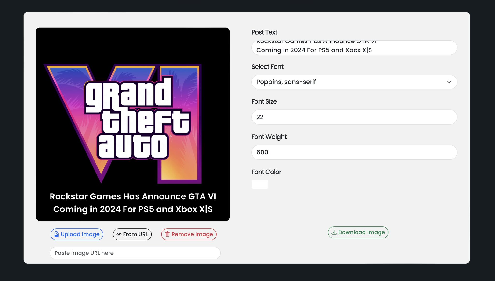

## CraftlyPost

This is a simple web-based tool for creating social media posts for creators. See [demo](https://mayadunneandco.com/lab/post-maker).

Built with Bootstrap 5 and Next.js.



## Getting Started

First, run the development server:

```bash
npm run dev
# or
yarn dev
# or
pnpm dev
# or
bun dev
```

Open [http://localhost:3000](http://localhost:3000) with your browser to see the result.

You can start editing the page by modifying `pages/index.js` and you can edit the page's css by modifying `styles/Home.module.css`. The page auto-updates as you edit the file.

## Learn More about Bootstrap

- [Bootstrap 5.3 Documentation](https://getbootstrap.com/docs/5.3/getting-started/introduction/)

## Learn More about Next.Js

To learn more about Next.js, take a look at the following resources:

- [Next.js Documentation](https://nextjs.org/docs) - learn about Next.js features and API.
- [Learn Next.js](https://nextjs.org/learn) - an interactive Next.js tutorial.